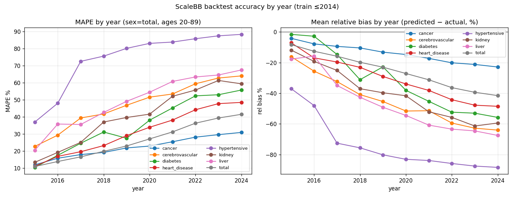
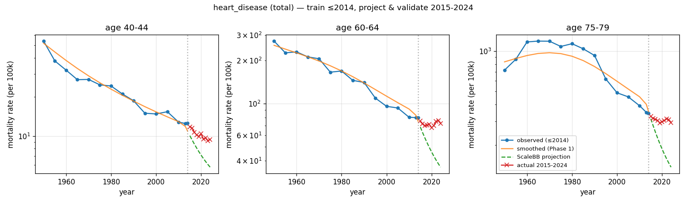
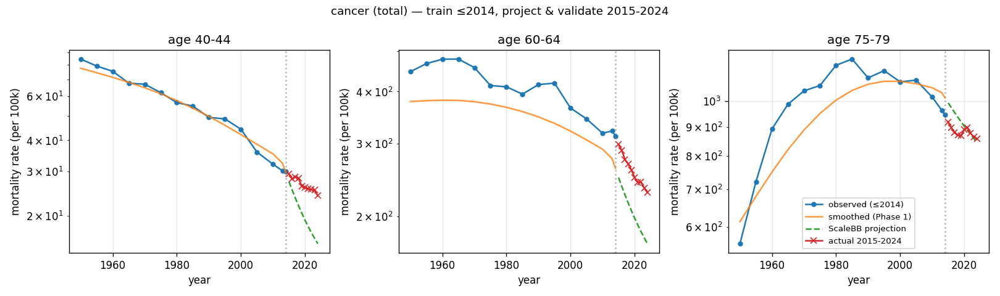
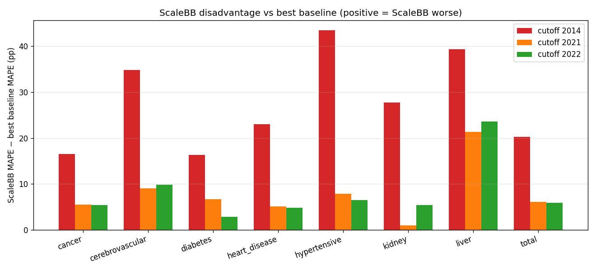
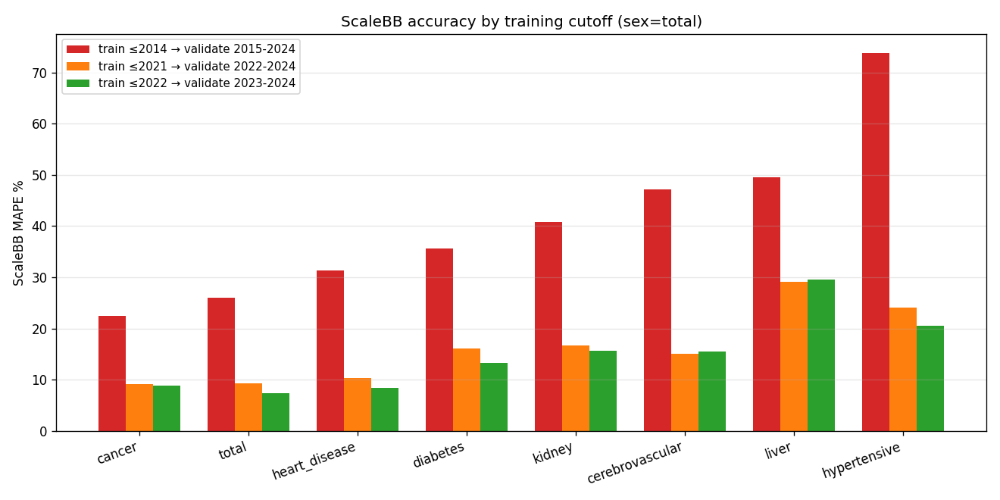

# §5 Results I — 点予測精度の検証結果 (Point-Forecast Accuracy)

本章では、§4 の 3 cutoff 設計に基づく点予測精度の結果を報告する。結論を先に述べると、Scale BB-D は全 cutoff・全セルで最良ベースラインに MAPE（式 3.9）で劣後する。当初目的（Scale BB-D による点予測の有用性検証）の枠内では、この結果は「Scale BB-D は短期点予測には不向き」という消極的結論に帰着する。本章はこの結果を隠さず正面から報告し、あわせて COVID-19 を学習に含めるか否かで精度がどう変わるか（独立の価値を持つ副産物）を定量化する。以下の数値はすべて再現パッケージ `reproduction/backtest/output/` の再生成結果に一致する（sex = total）。

---

## 5.1 Scale BB-D 単体の点予測精度（$y_c = 2014$）

観測を 2014 年で打ち切り、2015–2024 年の 10 年間を予測した場合の Scale BB-D 単体精度を示す。

| 疾病 | MAPE [%] | bias [per $10^5$] | MAPE 2015（1 年先） | MAPE 2024（10 年先） |
|---|---:|---:|---:|---:|
| `cancer` | 22.41 | +42.6 | 11.96 | 30.95 |
| `total` | 26.01 | −496.2 | 10.99 | 41.54 |
| `heart_disease` | 31.27 | −85.3 | 11.12 | 48.52 |
| `diabetes` | 35.59 | −3.9 | 10.48 | 55.75 |
| `kidney` | 40.87 | −5.1 | 13.46 | 59.39 |
| `cerebrovascular` | 47.14 | −59.1 | 22.77 | 64.03 |
| `liver` | 49.49 | −7.8 | 20.53 | 67.50 |
| `hypertensive` | 73.83 | −7.1 | 37.02 | 88.33 |

主要な観察は次の 3 点である。

1. 予測ホライズンとともに誤差が拡大する。 1 年先（2015 年）の MAPE は 10.5–37.0% と短期予測として実務上の許容水準にあるが、10 年先（2024 年）では 31.0–88.3% まで拡大する。Scale BB-D は観測終端付近の局所水準ではなく長期トレンドを尊重する構造モデルであるため、ホライズンが延びるほど累積的にトレンド外挿の誤差が効く。

2. `cancer` を除く全疾病が負バイアス（予測過小）を示す。 bias が負であることは予測 < 実績、すなわち Scale BB-D が改善継続を過剰に外挿し、2020–2022 年の COVID-19 起因の超過死亡を取り込めなかったことを意味する。トレンド外挿型モデルが構造ブレイクに脆弱であるという §4.2 の設計仮説がそのまま現れている。

3. `cancer` のみ正バイアス（予測過大）。 これは過去の緩やかな低減トレンドを超えて実際の治療進歩が速く進み、Scale BB-D の改善幅が実績に対して控えめだったことによる。

上記 3 点は図 5.1–5.3 に対応する。

図 5.1: 疾病別の年次 MAPE（左）と平均相対バイアス（右）の推移（$y_c = 2014$、sex = total、20–89 歳）。全疾病で予測ホライズンとともに MAPE が単調に拡大し（観察 1）、相対バイアスは `cancer` を除き負方向へ深化する（観察 2）。（再現: `reproduction/backtest/output/figures/overall_mape_bias_by_year.png`）

図 5.2: 心疾患（sex = total、代表 3 年齢）の観測率・Phase 1 平滑化率・Scale BB-D 投影（$y_c = 2014$）と実績 2015–2024。Scale BB-D（緑破線）は学習期の改善トレンドをそのまま外挿するため、COVID-19 期の超過死亡を含む実績（赤 ×）を系統的に下回る — 観察 2 の負バイアスの典型例である。（再現: `reproduction/backtest/output/figures/heart_disease_total_trajectory.png`）

図 5.3: 悪性新生物（sex = total、代表 3 年齢）の同トラジェクトリ。`cancer` では実績の低下が Scale BB-D 投影より速く、投影が実績を上回る（観察 3 の正バイアス）。（再現: `reproduction/backtest/output/figures/cancer_total_trajectory.png`）

## 5.2 ベースライン比較（$y_c = 2014$）— 全 24 セルで劣後

同一設定で Scale BB-D と 3 ベースライン（§3.4.1）を比較する。

| 疾病 | scalebb | naive_last | mean_3pts | loglin_trend | 最良ベースライン | 最良との差 [pp] |
|---|---:|---:|---:|---:|---|---:|
| `cancer` | 22.41 | 12.78 | 14.92 | 5.86 | loglin_trend | +16.55 |
| `total` | 26.01 | 8.73 | 12.79 | 5.74 | loglin_trend | +20.27 |
| `heart_disease` | 31.27 | 14.91 | 18.29 | 8.28 | loglin_trend | +22.99 |
| `diabetes` | 35.59 | 21.36 | 20.50 | 19.23 | loglin_trend | +16.36 |
| `kidney` | 40.87 | 14.52 | 13.10 | 14.63 | mean_3pts | +27.77 |
| `cerebrovascular` | 47.14 | 18.52 | 26.81 | 12.27 | loglin_trend | +34.87 |
| `liver` | 49.49 | 10.44 | 10.17 | 17.51 | mean_3pts | +39.32 |
| `hypertensive` | 73.83 | 39.29 | 30.33 | 35.88 | mean_3pts | +43.50 |

Scale BB-D は 24 セル（8 疾病 × 3 性別）すべてで 3 ベースライン全てに劣後する。 最良ベースラインとの差は、改善トレンドが明瞭な疾病（`cancer` / `total` / `heart_disease`）で loglin_trend に +16〜+23pp、トレンドが不明瞭な疾病（`liver` / `hypertensive`）で mean_3pts に +39〜+44pp である。図 5.4 はこの劣後幅を可視化している。sex = total での唯一の例外は `diabetes` の 2015 年単年のみで、ここだけ Scale BB-D が全ベースラインを上回る。

図 5.4: Scale BB-D MAPE − 最良ベースライン MAPE の差 [pp]（正 = Scale BB-D が劣後、sex = total）。$y_c = 2014$（赤）では全疾病で +16〜+44pp の劣後を示す。$y_c = 2021/2022$（橙・緑）では劣後幅が縮小するが符号は正のままである（§5.3）。（再現: `reproduction/backtest/output/cutoff_comparison/figures/scalebb_gap_vs_best_baseline.png`）

## 5.3 COVID-19 期を学習に含めた場合（$y_c = 2021 / 2022$）

学習打切りを 2021 / 2022 に移し、パンデミック期を学習に含めると、Scale BB-D の MAPE は劇的に縮小する。

| 疾病 | $y_c{=}2014$ | $y_c{=}2021$ | $y_c{=}2022$ |
|---|---:|---:|---:|
| `cancer` | 22.41 | 9.20 | 8.87 |
| `cerebrovascular` | 47.14 | 15.07 | 15.52 |
| `diabetes` | 35.59 | 16.02 | 13.29 |
| `heart_disease` | 31.27 | 10.27 | 8.37 |
| `hypertensive` | 73.83 | 24.13 | 20.53 |
| `kidney` | 40.87 | 16.69 | 15.59 |
| `liver` | 49.49 | 29.17 | 29.52 |
| `total` | 26.01 | 9.33 | 7.33 |

8 疾病すべてで MAPE が縮小し、その幅は 6〜8 倍に及ぶ（例: `hypertensive` 73.83 → 24.13、`total` 26.01 → 9.33）。同時に bias の絶対値も全疾病で縮小し、`liver` は $y_c{=}2021$ で（−7.8 → +0.1 per $10^5$）、`hypertensive` は $y_c{=}2022$ で（−7.1 → +0.4）符号が負から正へ転じる。これは構造ブレイクを学習に反映することの定量的価値を示しており、COVID-19 が疾病別死亡率に与えた影響の計測として、点予測の劣後とは独立の意義を持つ（図 5.5）。

図 5.5: 学習 cutoff 別の Scale BB-D MAPE（sex = total）。パンデミック期を学習に含めた $y_c = 2021$（橙）・$y_c = 2022$（緑）では、$y_c = 2014$（赤）に対して全疾病で MAPE が大幅に縮小する。ただし予測ホライズン（10 年 vs 2–3 年）も同時に短くなっている点に留意（§4.2）。（再現: `reproduction/backtest/output/cutoff_comparison/figures/scalebb_cutoff_comparison.png`）

ただし、MAPE の縮小は「ベースラインに追いつく」ことを意味しない。 最良ベースラインとの差（図 5.4）は $y_c{=}2014$ の +16〜+44pp から $y_c{=}2021/2022$ で +1〜+24pp へ縮むが、sex = total ではどの cutoff・どの疾病でも最良ベースラインに劣後する。「少なくとも 1 つのベースラインを上回る」セル数で見ても、24 セル中それぞれ 0 / 10 / 7 セルにとどまる（全ベースラインを上回るのは $y_c{=}2021/2022$ で各 2 セルのみ）。学習データを増やせば Scale BB-D は naive_last や loglin_trend のいずれかとは競合する水準まで来る（例: `kidney` は $y_c{=}2021$ で naive_last(19.85) と mean_3pts(17.36) を上回るが、最良の loglin_trend(15.69) には +1.00pp 及ばない）が、最良手法には届かない。

## 5.4 総括 — 消極的結論と次章への転換

点予測精度に関する検証結果は明快である。

- 短期（1–3 年先）: Scale BB-D の MAPE は 10–30% で実務上の許容水準にあるが、それでもベースラインに劣後する。
- 長期（10 年先）: MAPE は 22–74% に拡大し、劣後幅も最大化する。
- 全 cutoff・全 24 セルで Scale BB-D は最良ベースラインに MAPE で劣後する。

当初目的が「点予測の精度」であったなら、本章の結論は「Scale BB-D は短期点予測には不向きであり、直近水準を持ち越す naive_last や対数線形外挿 loglin_trend の方が高精度」という消極的なものである。 これは Scale BB-D 本来の設計思想（数十年スパンの長期改善トレンドを抽出するモデルであり、翌年の水準を最小誤差で当てる道具ではない）と整合する結果でもある。

しかし、点予測精度という単一の軸で Scale BB-D を評価することは、この構造モデルの本質的な出力——方向性が保証された改善率 $i^*(x, y)$——を測り損ねている可能性がある。次章 §6 では、当初目的では測っていなかった方向性的中率 DA（式 3.12）を計測する。そこで景色は一変し、本章の消極的結論は「失敗」ではなく「問いの立て直し」へと転換する。

---

*本章で示した「点予測 MAPE でのベースラインへの一貫した劣後」は、§6 の方向性的中率の発見と対をなす。両者の乖離こそが、§7 で Scale BB-D をシナリオ生成器として再定位する論拠の核心である。*
