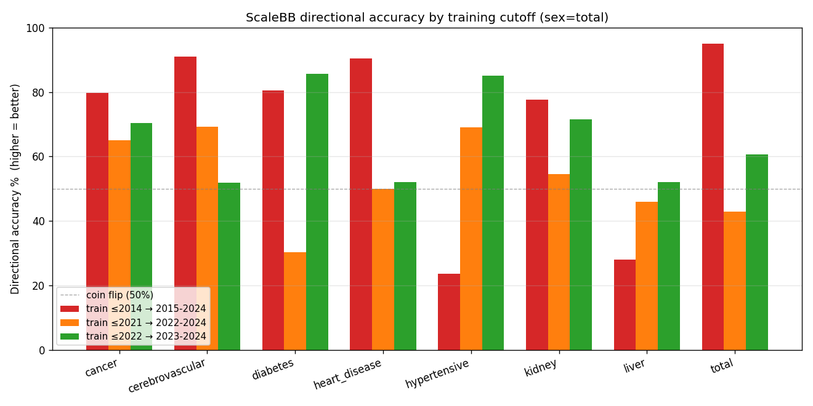
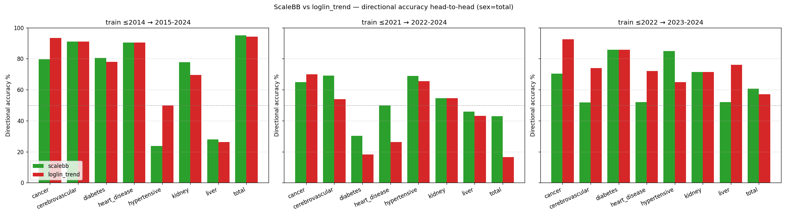
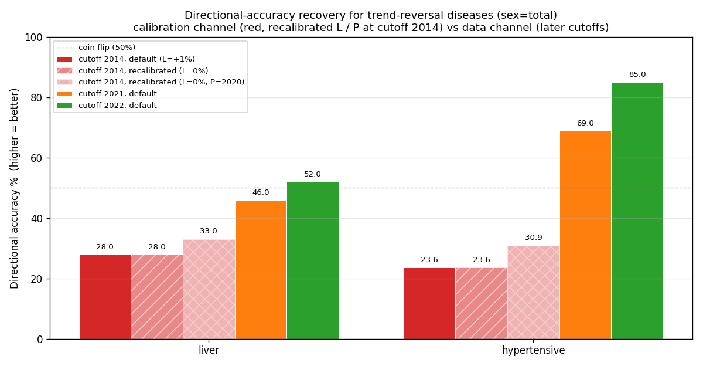

# §6 Results II — 方向性的中率の発見 (The Directional Accuracy Finding)

本章では、当初の検証計画(§4)では測っていなかった第二の評価軸——方向性的中率 DA(式 3.11–3.12)——を計測する。結論を先に述べると、§5 で点予測 MAPE の劣後が最も大きかった $y_c = 2014$(10 年先予測)において、主要 6 疾病(全死因・脳血管・心疾患・糖尿病・がん・腎不全)の方向一致率は 77.7–95.0% に達する。点予測で全敗した同じモデルが、トレンドの符号(改善か悪化か)はほぼ正しく捉えていた——この乖離が、本論文の中心的発見である。以下の数値はすべて再現パッケージ `reproduction/backtest/output/directional/` の再生成結果に一致する(sex = total)。

---

## 6.1 $y_c = 2014$ の方向性的中率 — 主要 6 疾病で 77.7–95.0%

MAPE の劣後幅が最大だった $y_c = 2014$(2015–2024 年の 10 年間を予測)について、疾病別の方向性的中率を示す。DA の評価対象は実績変化が生じたセルに限られるため(式 3.12)、有効セル数 $n$ を併記する(§4.3)。

| 疾病 | $n$(有効セル) | DA [%] |
|---|---:|---:|
| `total` | 140 | 95.00 |
| `cerebrovascular` | 134 | 91.04 |
| `heart_disease` | 137 | 90.51 |
| `diabetes` | 123 | 80.49 |
| `cancer` | 138 | 79.71 |
| `kidney` | 112 | 77.68 |
| `liver` | 118 | 27.97 |
| `hypertensive` | 110 | 23.64 |

§5.1 の結果と並べると乖離の大きさが際立つ。たとえば `cerebrovascular` は MAPE 47.14% と点予測では 8 疾病中ワースト 3 位だが、方向一致率は 91.04% に達する。`total` は 10 年先の水準を平均 26% 外しながら、140 セル中 133 セルで変化の向きを正しく当てている。すなわち Scale BB-D の誤差は「向きを外す」誤差ではなく、「正しい向きに行き過ぎる(改善を過剰外挿する)」誤差である——§5.1 で観察した負バイアスの支配と整合的である。

一方、`liver`(27.97%)と `hypertensive`(23.64%)の 2 疾病は方向ごと外している。これは 2010 年代半ば以降にこれらの死亡率が上昇局面へ転じたのに対し、既定設定($L = +1\%$、改善継続)が改善方向の投影を生成し続けたためであり、§6.5 で詳しく扱う。

## 6.2 3 cutoff 横断 — 学習期間によらず方向を捉えるか

学習打切りを 3 通りに振った場合の Scale BB-D 方向性的中率を表と図 6.1 に示す。

| 疾病 | $y_c{=}2014$ | $y_c{=}2021$ | $y_c{=}2022$ |
|---|---:|---:|---:|
| `total` | 95.00 | 42.86 | 60.71 |
| `cerebrovascular` | 91.04 | 69.23 | 51.85 |
| `heart_disease` | 90.51 | 50.00 | 52.00 |
| `diabetes` | 80.49 | 30.30 | 85.71 |
| `cancer` | 79.71 | 65.00 | 70.37 |
| `kidney` | 77.68 | 54.55 | 71.43 |
| `liver` | 27.97 | 45.95 | 52.00 |
| `hypertensive` | 23.64 | 68.97 | 85.00 |

図 6.1: 学習 cutoff 別の Scale BB-D 方向性的中率(sex = total)。破線はチャンスレベル(コイン投げ、50%)。$y_c = 2014$(赤)では改善継続 6 疾病がチャンスレベルを大きく上回る一方、`liver` / `hypertensive` は大きく下回る。$y_c = 2021/2022$(橙・緑)では逆に `liver` / `hypertensive` が回復する(§6.5)。(再現: `reproduction/backtest/output/directional/figures/scalebb_directional_per_cutoff.png`)

図 6.1 の読み方には 2 点の留意が要る。第一に、統計的に最も安定なのは $y_c = 2014$ である。有効セル数は $y_c = 2014$ で 110–140 に対し、$y_c = 2021$ は 29–42、$y_c = 2022$ は 20–28 にすぎず(§4.3)、検証期間の短い cutoff の DA は数セルの帰趨で 10pp 単位で動く。第二に、検証期間が短い場合の低下は COVID-19 直後の年次変動を反映している。たとえば `total` の $y_c = 2021$(42.86%)は、2021 年の超過死亡水準を観測終端として 2022–2024 年の揺り戻しの向きを問う設定であり、数十年トレンドの符号を問う $y_c = 2014$ とは性格が異なる。`diabetes` が 30.30%($y_c{=}2021$)から 85.71%($y_c{=}2022$)へ振れるのも同じ短期ノイズの表れである。長期トレンドの方向性という本章の主題に対しては、検証期間 10 年・140 セルの $y_c = 2014$ の結果——改善継続疾病で 77.7–95.0%——が最も信頼できる推定値である。

## 6.3 ベースライン比較 — 方向情報を持つ手法は限られる

同一の定義で 4 手法の DA を比較する。24 比較(8 疾病 × 3 cutoff、sex = total)での Scale BB-D の勝敗は次のとおりである。

| 比較対象 | Scale BB-D 勝 | 同点 | 負 |
|---|---:|---:|---:|
| vs `naive_last` | 24 | 0 | 0 |
| vs `mean_3pts` | 15 | 0 | 9 |
| vs `loglin_trend` | 12 | 5 | 7 |

`naive_last` は構造上 $\Delta_{\text{pred}} \equiv 0$ であり(式 3.11)、方向情報を一切持たない(DA = 0%)。§5 で MAPE 最強クラスだった手法が、方向という軸では評価の土俵にすら乗らない——これが MAPE と DA の乖離の最も端的な表れである。`mean_3pts` が持つ方向情報は偶発的なものである。直近 3 点平均が cutoff 年の観測値からずれた分だけ「変化」を予測するため、cutoff 年の値がたまたま下振れした疾病(上昇局面の `hypertensive` で 76.36%、`liver` で 61.02%)では高く出るが、改善が明瞭な疾病ではほぼ系統的に外す(`total` で 4.29%)。トレンド構造に基づく方向情報ではない。

唯一の意味ある対抗馬は、OLS 傾きという陽な方向情報を持つ `loglin_trend` である。Scale BB-D は 12 勝 5 分 7 敗で正味勝ち越すが、内訳に構造がある。$y_c = 2014$ では `cerebrovascular`(91.04%)と `heart_disease`(90.51%)で両者完全に同値、`total` は 95.00% 対 94.29% とほぼ同値であり、改善トレンドが明瞭な疾病では長期構造モデルと対数線形外挿が同じ符号に到達する。Scale BB-D の負けは主に `cancer`(3 cutoff すべてで劣後、$y_c{=}2014$ で 79.71% 対 93.48%)と、検証期間が 2 年と短い $y_c = 2022$ に集中する。逆に $y_c = 2021$ では `heart_disease`(50.00% 対 26.19%)や `total`(42.86% 対 16.67%)で Scale BB-D が大きく上回る。COVID 期を含む直近 15 年の OLS が水準シフトに引きずられて方向を外す局面でも、数十年の構造から方向を決める Scale BB-D は崩れ方が緩やかである(図 6.2)。

図 6.2: Scale BB-D(緑)と `loglin_trend`(赤)の方向性的中率の直接比較(sex = total、3 cutoff 横並び、破線は 50%)。左($y_c{=}2014$)では `cancer` を除き同等以上、中央($y_c{=}2021$)では `heart_disease` / `total` / `cerebrovascular` で Scale BB-D が優位、右($y_c{=}2022$)では短い検証期間のノイズの中で `loglin_trend` が優位のセルが増える。(再現: `reproduction/backtest/output/directional/figures/scalebb_vs_loglin_directional.png`)

## 6.4 乖離は何を意味するか — 構造モデルと点予測器の本質的差異

MAPE(§5)と DA(本章)の乖離は、偶然ではなくモデルの設計に由来する。`naive_last` / `mean_3pts` は「直近水準が続く」と仮定する点予測器、`loglin_trend` は「直近 15 年の対数線形傾きが続く」とする短期外挿器である。短期(1–3 年)の水準は観測終端の水準と直近トレンドでほぼ決まるため、点予測ではこれらが構造的に有利になる。一方 Scale BB-D は、観測終端付近の局所水準よりも、60 年超の観測から抽出した長期トレンドと長期率 $L$ への収束(式 3.5)を尊重する設計であり、観測終端付近のノイズや短期ショックをあえて無視する。これが短期 MAPE で劣後する根本原因である(§5.4)。

その代償として得ているのが方向の安定性である。改善率の符号は数十年スパンの構造から決まるため、観測終端がどの局面にあっても大きく揺れない——§6.2 で見た cutoff 横断の頑健性はその表れである。すなわち Scale BB-D は「次年度の水準を最小誤差で当てる道具」ではなく、「長期トレンドの方向と強度を、方向性が検証された改善率 $i^*(x, y)$ として陽に取り出す道具」である。水準の点予測を問う限り §5 の消極的結論は覆らないが、改善率の符号と操作可能性を問う用途——複数シナリオの生成——では、この性質こそが要件になる(§2.3、§7)。

## 6.5 方向反転疾病の扱い — キャリブレーションの適用範囲と限界

`liver` / `hypertensive` の方向外れ(DA 23.6–28.0%)は、Scale BB-D の既定設定 $L = +1\%$(改善継続)が、2010 年代半ば以降の上昇転換という事実と食い違ったケースである。実務適用上の関心は「この方向外れは修正可能か」にある。ここでは 2 つの修正経路——(i) キャリブレーション経路: 疾病別に $L$・$P$ を再設定する、(ii) データ経路: 反転後の直近データを学習に取り込む——を切り分けて検証する。結果を表 6.1 と図 6.3 に示す。

表 6.1: 方向反転疾病の再キャリブレーション実験(sex = total、DA [%])

| 設定 | 経路 | `liver` | `hypertensive` |
|---|---|---:|---:|
| $y_c{=}2014$、既定($L{=}{+}1\%$, $P{=}2035$) | — | 27.97 ($n{=}118$) | 23.64 ($n{=}110$) |
| $y_c{=}2014$、$L{=}0\%$($P$ 据置) | キャリブレーション | 27.97 | 23.64 |
| $y_c{=}2014$、$L{=}0\%$, $P{=}2020$ | キャリブレーション | 33.05 | 30.91 |
| $y_c{=}2021$、既定 | データ | 45.95 ($n{=}37$) | 68.97 ($n{=}29$) |
| $y_c{=}2022$、既定 | データ | 52.00 ($n{=}25$) | 85.00 ($n{=}20$) |

図 6.3: 方向反転疾病の方向一致率の回復 — キャリブレーション経路(赤系: $y_c = 2014$ のまま $L$・$P$ を再設定)とデータ経路(橙・緑: 反転後データを学習に取り込む)。破線は 50%。(生成スクリプト: `reproduction/backtest/make_calibration_recovery_figure.py`)

この実験は 3 つの事実を示す。

1. 長期率の差し替えだけでは、検証期間内の方向は変わらない。 $L$ を $+1\%$ から $0\%$ へ引き下げても DA は不変である($-1\%$ まで下げても同じ)。理由は式 (3.5) の構造にある。検証区間 2015–2024 は全域がブレンド区間 $y_{\text{obs}} < y < P$ に含まれ(§4.1)、そこでの改善率は観測終端改善率 $i(x, y_c)$ と $L$ の線形内分で与えられるが、観測終端に近い年ほど $i(x, y_c)$ 側の重みが大きい。$y_c = 2014$ の $i(x, y_c)$ は学習期の改善継続を反映して正であり、さらに観測格子が 5 年刻みから年次へ切り替わる境界に観測終端が重なるため平滑化値が実勢より大きく出る(図 3.3 で注意した境界効果と同根)。短期の投影方向はこのアンカーが支配し、$L$ はほとんど寄与しない。

2. 収束年の前倒しを併用すると部分的に回復するが、限定的である。 $L = 0\%$ に加えて $P$ を 2035 から 2020 へ前倒しすると、観測終端アンカーの支配が早期に解けて DA は 33.05% / 30.91% まで改善するが、なおチャンスレベルを下回る。検証期間の大半が反転前の正の改善率で投影されるためである。

3. 本格的な回復はデータ経路で起こる。 反転後の観測を学習に含めた $y_c = 2021/2022$ では、キャリブレーションを一切変えない既定設定のまま、`liver` は 45.95 / 52.00%、`hypertensive` は 68.97 / 85.00% まで回復する。Phase 1 が抽出する観測改善率 $i(x, y)$ の符号自体がデータから修正されるためであり、Scale BB-D は直近トレンドが学習に反映されれば構造的に方向修正が効く。

この切り分けの実務的含意は次のとおりである。$L$・$P$ の疾病別キャリブレーションが支配するのは収束年以降の長期の方向であり、その効果は 10 年の検証期間では観測できない——だが保険負債評価の投影ホライズン(数十年)ではそこが支配的になるため、反転疾病に対する $L \le 0$ への再設定は長期シナリオの整合性の必要条件である(疾病別キャリブレーション指針は §9.1)。一方、観測終端付近の短期の方向は、キャリブレーションではなく最新データでの定期的な再フィットが担う。すなわち「疾病別の長期率設定」と「定期再フィット」は代替ではなく分担の関係にある。付言すれば、この修正可能性自体が構造モデルに固有の性質である。`naive_last` には修正すべき方向情報がなく、`loglin_trend` で傾きの符号を手動反転させることは推定の前提を放棄することに等しい。改善率とその長期想定を陽なパラメータとして持つからこそ、方向の誤りを特定し、修正し、再検証できる。

最後に、この検証可能性の限界が持つ意味を明確にしておく。$L$ の長期効果それ自体は、収束年以降の実績が蓄積するまで直接検証できない(既定設定では 2035 年以降の実績を要する)。ただしこれは本フレームワーク固有の弱点ではなく、長期改善想定というもの一般の性質である。しかも実績を待つ間にも次の構造ブレイク——新たな感染症の流行や医療技術の転換——が混入しうる以上、「データの十分な蓄積を待って検証を完結させる」という方針は原理的に閉じない。本フレームワークの設計はその逆を行く。限られたデータでも検証可能な部分——改善率の方向性——は本章までの検証で固めた土台とし、検証の届かない長期想定は、暗黙の前提として埋め込むのではなく解釈可能な少数パラメータ($L$・$P$)として明示し、シナリオとして振る対象へ転換する(§7)。将来の構造ブレイクについても、事後には定期再フィットが方向を自動修正し(本節のデータ経路が COVID-19 で実証したとおり)、事前には $L \le 0$ やカタストロフィショックといったストレスシナリオとして定量化しておくことができる。長期の不確実性を点予測で言い当てようとするのではなく、検証済みの方向性の上で不確実性を陽に扱う——この構えこそが、単一の点予測ではなくシナリオ間整合性を要求する経済価値ベース評価(§2.3)と整合する。

---

*§5 の「点予測は全敗」と本章の「方向は 77.7–95.0% 的中」という乖離は、Scale BB-D の価値が単年水準の予測にはなく、方向性が検証された改善率 $i^*(x, y)$ の陽出力にあることを示している。次章 §7 では、この性質が経済価値ベース評価(ICS / IFRS 17)の要求するシナリオ生成構造(§2.3)へ、どのように一対一に翻訳されるかを論じる。*
