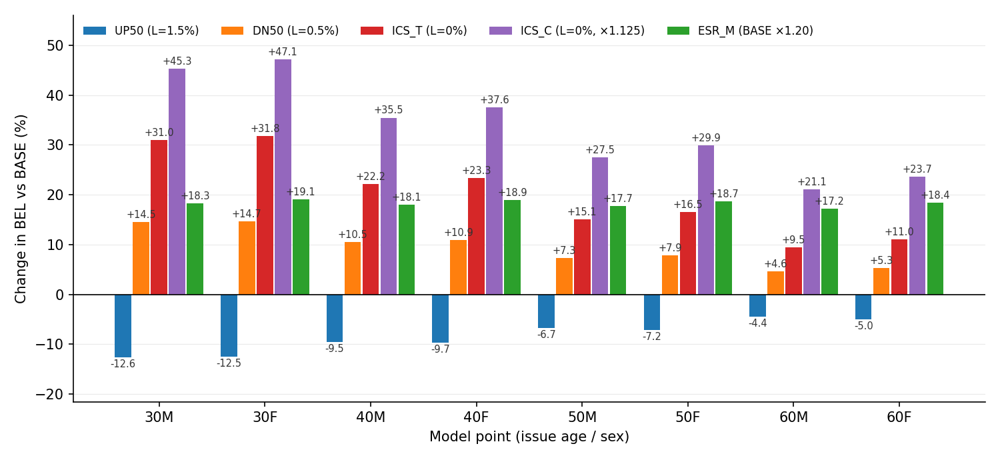

# §8 財務インパクトのデモ (Financial Impact Demonstration)

本章では、§7 で示した「シナリオ生成器としての再定位」の実務的意義を、簡易プロジェクションモデル上の BEL(給付現価)感応度として定量的に示す。目的は精緻な負債評価ではなく、長期改善率 $L$ の操作が給付現価に与える影響の方向と桁を、経済価値ベースの評価枠組みにそのまま適用できる形で提示することである。計算は 2026 年 3 月 31 日に日本で適用が開始された経済価値ベースのソルベンシー規制(ESR)の実装仕様に、簡易モデルの範囲で可能な限り準拠させた(§8.1)。

---

## 8.1 デモの設計 — 簡易モデルと ESR 実装仕様への準拠

計算主体は決定論的・年次ステップの簡易プロジェクションモデルである。発行年 2026 年・加入年齢 $x_0$ のモデルポイントに対し、給付現価を

$$
\mathrm{BEL}(x_0) \;=\; \sum_{t=0}^{T-1} P(t)\, S(t)\,
q_{\text{dis}}(x_0 + t,\; 2026 + t)\, \mathrm{SA}
\tag{8.1}
$$

$$
S(0) = 1, \qquad
S(t+1) \;=\; S(t)\,\bigl(1 - q_{\text{dis}} - q_{\text{death}} - q_{\text{lapse}}\bigr)
\tag{8.2}
$$

で評価する。ここで $q_{\text{dis}}$ は 3 疾病(がん・心疾患・脳血管疾患)のシナリオ別クレーム率の合計、$q_{\text{death}}$ は全死因の投影率(ベースシナリオで固定・全シナリオ共通 — 感応度を疾病率の変化のみに帰着させるため)、$q_{\text{lapse}}$ は解約率、$P(t)$ は年限 $t$ の割引係数、$\mathrm{SA}$ は保険金額である。各年齢・各年の率は、§3 のフレームワークが出力する率曲面 $m(x, y)$ の世代対角線 $m(x_0 + t,\, 2026 + t)$ から取得する。

ESR の実装仕様への準拠は次の 4 点である。

1. BEL の位置づけ。 式 (8.1) は、ESR における保険負債のうち「現在推計」(計算前提を基準日で再評価した将来キャッシュフローの現在価値)に対応する。生命保険リスク内のサブリスク統合と MOCE(不確実性マージン、Margin Over Current Estimate)は §8.5 で簡易計算する。リスクカテゴリー間(市場・信用・オペリスク等との)統合、適格資本、ESR 比率そのものは、資産側を持たない本デモの範囲外とする。
2. 割引率。 割引係数 $P(t)$ には、金融庁が公表する「イールド・カーブ作成ツール」(2026 年 3 月末基準)のパラメータ — 円金利の観測最終年限 30 年、終局金利(UFR: Ultimate Forward Rate)3.8%、収束年限 60 年、および年限別ゼロクーポン無リスク金利(観測 13 年限)— から、Smith-Wilson 補外により再現した無リスク金利カーブを用いる(観測年限は完全再現、収束年限における瞬間フォワードは UFR ±1bp 以内)。一般バケット等のスプレッド調整は適用しない。
3. 感応度の測定方式。 ESR の生命保険リスクは「経済価値ベースの資産・負債に所定のストレスを与えた場合の純資産の変動額を計測する方式」(ストレス方式)で計算される。本デモの感応度 $\Delta \mathrm{BEL}$ はこれと同型であり、資産側を不変とすればストレス方式の純資産減少額にそのまま対応する。
4. 規制ストレス係数の採用。 シナリオの一部(§8.2 の ESR_M と ICS_C のレベル部分)には、1 柱告示(令和 7 年金融庁告示第 74 号)が定めるストレス係数そのもの — 罹患・障害リスクの発生率 +20%(第 59・60 条: 健康事象発現時の一時金を提供する商品区分・保険期間 5 年超・日本)、死亡リスクの死亡率 +12.5%(第 56 条: 日本)— を用いる。

一方、簡易モデルとしての限界も明示する。キャッシュフローは給付のみであり保険料・事業費は含まない(給付現価としての評価)。脱退は独立近似で処理し、全死因死亡率には 3 疾病由来の死亡が含まれる(全シナリオ共通のため感応度への影響は二次的)。また §3.1.3 のとおり、率は死因別死亡率であり、医療保険の発生率に対しては代理である。保険会社で導入実績のある実務プロジェクションモデル上での再実行は今後の検証課題である(§10)。

## 8.2 シナリオとモデルポイント

シナリオは次の 6 本である。いずれも §3.2 の同一の fit(Phase 1)を共有し、UP50/DN50/ICS_T は設定 $L$ の差し替えによる Phase 2 再投影のみ、ICS_C・ESR_M は率への一律乗算のみで生成される。

| SCN_CD | 内容 | 生成方法 | 規制上の位置づけ |
|---|---|---|---|
| BASE | ベース($L = 1.0\%$) | 既定設定 | 現在推計のベースシナリオ |
| UP50 | 改善加速($L = 1.5\%$) | $L$ 差し替え | IFRS 17 感応度開示 +50bp |
| DN50 | 改善減速($L = 0.5\%$) | $L$ 差し替え | IFRS 17 感応度開示 −50bp |
| ICS_T | 改善停止($L = 0\%$) | $L$ 差し替え | トレンドショック(改善率ゼロ) |
| ICS_C | 改善停止+レベル | ICS_T × 1.125 | トレンド+死亡レベルショックの合成(+12.5% は告示第 56 条の死亡リスク係数と同水準) |
| ESR_M | 罹患ストレス | BASE × 1.20 | 告示第 59・60 条 罹患・障害リスク(一時金区分・長期・日本: 発生率 +20%) |

モデルポイントは、三大疾病一時金 100 万円(初回罹患時)・90 歳満了の保障を、加入年齢 30/40/50/60 歳 × 男女の 8 点(MP01–MP04 男性、MP05–MP08 女性)に置いたものである。解約率は年 3% 固定、死亡脱退は全死因投影率で、いずれも全シナリオ共通とする。

シナリオ表は、§3.1.3 の二層の適用可能性と次のように対応する。同一の率テーブルが、(i) 医療保険の疾病発生率の代理として読む場合は罹患・障害リスク(ESR_M)の対象となり、(ii) 特定疾病死亡保障のアサンプションとして読む場合は死亡リスク(+12.5%、ICS_C のレベル部分と同水準)の対象となる。すなわち本デモの一表は、二層のどちらの読み方でも規制ストレスとの対応を持つ。

## 8.3 結果 — BEL 感応度の一表

表 8.1 に、モデルポイント別の BASE シナリオ BEL(保険金額 100 万円あたり、円)と、各シナリオの BASE 比変化率を示す。

表 8.1: モデルポイント別 BEL 感応度(BASE 比変化率 %)

| MP | 加入年齢・性別 | BASE BEL(円) | UP50 | DN50 | ICS_T | ICS_C | ESR_M |
|---|---|---:|---:|---:|---:|---:|---:|
| MP01 | 30 男 | 14,420 | −12.6 | +14.5 | +31.0 | +45.3 | +18.3 |
| MP02 | 40 男 | 29,094 | −9.5 | +10.5 | +22.2 | +35.5 | +18.1 |
| MP03 | 50 男 | 56,215 | −6.7 | +7.3 | +15.1 | +27.5 | +17.7 |
| MP04 | 60 男 | 100,454 | −4.4 | +4.6 | +9.5 | +21.1 | +17.2 |
| MP05 | 30 女 | 9,681 | −12.5 | +14.7 | +31.8 | +47.1 | +19.1 |
| MP06 | 40 女 | 19,221 | −9.7 | +10.9 | +23.3 | +37.6 | +18.9 |
| MP07 | 50 女 | 36,139 | −7.2 | +7.9 | +16.5 | +29.9 | +18.7 |
| MP08 | 60 女 | 62,764 | −5.0 | +5.3 | +11.0 | +23.7 | +18.4 |
| 合計 | — | 327,988 | −6.6 | +7.2 | +15.0 | +27.7 | +18.0 |

図 8.1: モデルポイント別・シナリオ別の BEL 感応度(BASE 比変化率 %)。横軸はモデルポイント(加入年齢・性別、加入年齢順)、系列は UP50 / DN50 / ICS_T / ICS_C / ESR_M の 5 シナリオ。(生成スクリプト: `ScaleBB/Research/scripts/bel_demo/aggregate_bel_results.py`)

結果は 3 点に要約できる。第一に、全モデルポイントで $L$ に対する単調性(UP50 < BASE < DN50 < ICS_T < ICS_C)が成立し、$L$ の操作が給付現価に整合的に翻訳されている。第二に、感応度には明瞭な年齢勾配があり、加入年齢が若いほど大きい(ICS_T で 30 歳 +31〜32% に対し 60 歳 +10〜11%)。改善トレンドの変化は残存期間にわたって複利的に蓄積するため、長期の契約ほど影響が大きいという直感と整合する。第三に、女性は BASE の給付現価水準が男性より低い一方、変化率でみた感応度は全シナリオで男性をやや上回る。

## 8.4 考察 — トレンドショックとレベルショックの対比

表 8.1 で最も示唆的なのは、ESR_M と ICS_T の対比である。告示のストレス方式による罹患・障害リスク(ESR_M: 発生率 +20% の一律レベルショック)の影響は、加入年齢によらずほぼ一定(+17.2〜+19.1%)である。これは静的な率テーブルに一律係数を乗じるという現行実務の構造(§2.3)がもたらす当然の帰結である。一方、トレンドショック(ICS_T: 改善率ゼロ)の影響は +9.5% から +31.8% までの年齢勾配を持ち、合計では規制レベルショックに近い水準(+15.0% 対 +18.0%)でありながら、30 歳では規制レベルショックの約 1.7 倍、60 歳では 6 割弱となる。

この対比は 2 つの実務的含意を持つ。第一に、改善トレンドの不確実性は若年・長期の契約に集中するため、一律のレベル係数だけでリスクを把握すると、ポートフォリオの年齢構成によってはトレンドリスクを系統的に過小評価(または過大評価)しうる。第二に、この時間構造を持つショックは、改善率 $i^*(x, y)$ を陽に出力する枠組みでなければ生成できない(§7.3 のベースライン手法の限界)。本フレームワークでは $L$ の差し替えのみで生成でき、しかも §6 で示したとおりその方向性はバックテストで事前検証されている。規制の第 1 の柱の標準的手法がレベルショックを基本とする中で、ORSA・感応度開示・内部管理(第 2 の柱)においてトレンドシナリオを補完的に走らせる用途に、本フレームワークは追加の改修なくそのまま適用できる。

なお、ICS_C のレベル部分(×1.125)は告示第 56 条の死亡リスク係数(日本 +12.5%)と同水準であり、特定疾病死亡保障(新規性 B・直接適用の層)に対しては、ICS_C が「トレンドショックと規制死亡ストレスの合成」という規制対応上の解釈をそのまま持つ。医療保険(発生率への代理適用の層)に対しては ESR_M が対応する。二層のいずれの読み方でも、本デモの感応度は規制ストレスの語彙で解釈可能である。

導入負担の議論は §9.2 で行う。

## 8.5 拡張 — 生命保険リスク所要資本と保険負債の簡易計算

前節までの感応度は個別ストレスの $\Delta \mathrm{BEL}$ であった。本節では 1 柱告示の標準的手法に一段踏み込み、本ポートフォリオの生命保険リスクのサブリスク 5 種を告示のストレス係数(いずれも日本の地理的区分)で計算し、相関統合(第 81 条)と MOCE(第 29 条)まで進めた結果を示す。

表 8.2: 生命保険リスク所要資本と保険負債の簡易計算(8 モデルポイント合計、円)

| 項目 | 額(円) | 適用した告示の規定 |
|---|---:|---|
| サブリスク: 死亡 | 0 | 第 56 条(死亡率 +12.5%。本商品では死亡は脱退側のため純資産減少に該当せず 0) |
| サブリスク: 長寿 | 11,698 | 第 57 条(死亡率 −20% → 生存者増加により給付現価増) |
| サブリスク: 罹患・障害 | 58,917 | 第 59・60 条(発生率 +20%。表 8.1 の ESR_M の ΔBEL と定義上一致) |
| サブリスク: 解約・失効 | 50,096 | 第 61〜63 条(水準トレンド ±25% と大量解約 30% の大きい方。本商品は解約率低下側が拘束) |
| サブリスク: 経費 | 0 | 第 64 条(本デモは経費キャッシュフローを持たない) |
| 生命保険リスク(相関統合後) | 80,067 | 第 81 条の相関行列(単純合算 120,711 に対し分散効果 −34%) |
| 現在推計(BASE BEL 合計) | 327,988 | 式 (8.1) |
| MOCE | 32,286 | 第 29・30 条(資本コスト率 3%、推計所要資本のランオフ・パターン近似。現在推計比 9.8%) |
| 保険負債(現在推計 + MOCE) | 360,273 | — |

この計算は 3 点の含意を持つ。第一に、本商品(罹患給付)の生命保険リスクの最大の構成要素は罹患・障害リスクであり、その額は表 8.1 の ESR_M シナリオがそのまま与える — すなわち本フレームワークの率テーブル出力は、感応度分析だけでなく所要資本のストレス方式計算にも同じ形式でそのまま適用できる。第二に、死亡リスクが 0 となるのは本商品では死亡が脱退(給付減少)側に働くためであり、同じ率テーブルを特定疾病死亡保障(新規性 B)として読む場合には、死亡ストレス +12.5% がクレーム率に直接かかる(ICS_C のレベル部分)という対照が、二層適用の規制上の差異を端的に示す。第三に、規制の標準的手法はここまで一貫して静的なレベルストレスで構成されており、改善トレンドの不確実性(§8.4 で示した年齢勾配を持つリスク)は第 1 の柱の標準的手法には現れない — トレンドシナリオの定量把握は ORSA・内部管理(第 2 の柱)と感応度開示(第 3 の柱)の領域であり、そこが本フレームワークの主たる実装先となる(§9)。

なお本節の計算は、単一商品・給付キャッシュフローのみの簡易ポートフォリオに標準的手法を適用した例示であり、実際の所要資本計算に必要な同質なリスクグループの設定、経費・保険料キャッシュフロー、リスクカテゴリー間統合は含まない。

---

*本章のデモは、方向性が検証された改善率の陽出力(§6–§7)が、ESR 適用初年度の実装仕様の上で具体的な感応度の数字に翻訳されることを示した。次章 §9 では、これを実務に導入する際のキャリブレーション指針と導入負担を論じる。*
